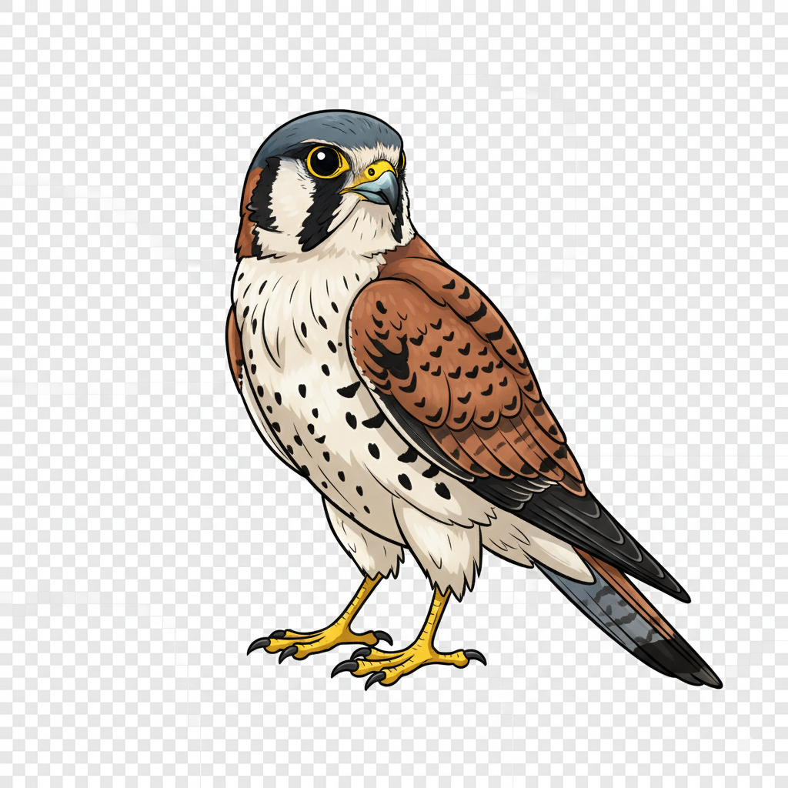

<div align="center">
  <br/>
  
  <h1>Kestrel</h1>
  <p>
    A distributed, k-sortable unique ID generation system using Redis and Lua, inspired by Icicle.
  </p>
  <p>
  <a href="https://badge.fury.io/js/@dreamystify%2Fkestrel">
    
  </a>
  <a href='https://coveralls.io/github/Dreamystify/kestrel ?branch=main'>
    
  </a>

  </p>
</div>

## Getting started

### Prerequisites

- Node.js v20+ (ES modules support required)
- Redis v7+ (or a Redis Cluster for distributed mode)

```sh
# Initialize the repo (if applicable)
./.scripts/init.sh
```

## Installation

```sh
npm install @dreamystify/kestrel
```

To build the package locally with esbuild, run:

```sh
ahoy build
```

## ES Modules Support

This package is built as an ES module and requires Node.js v18+ with ES modules
support. When using this package:

- Use `import` statements instead of `require()`
- Ensure your `package.json` has `"type": "module"` or use `.mjs` file
  extensions
- The package exports are optimized for ES module resolution

## Usage

The Kestrel library supports three connection modes: standalone, Sentinel, and
Cluster. Below are examples for each mode.

### Standalone Mode

```javascript
import { Kestrel } from '@dreamystify/kestrel';

(async () => {
  // Initialize Kestrel with standalone Redis
  const kestrel = await Kestrel.initialize({
    host: 'localhost',
    port: 6379,
    username: 'yourUsername', // if using authentication
    password: 'yourPassword', // if using authentication
    database: 0,
  });

  // Generate a single unique ID
  const id = await kestrel.getId();
  console.log('Generated ID:', id);

  // Generate a batch of 3 IDs
  const ids = await kestrel.getIds(3);
  console.log('Generated IDs:', ids);
})();
```

### Sentinel Mode

```javascript
import { Kestrel } from '@dreamystify/kestrel';

(async () => {
  // Initialize Kestrel using Redis Sentinel
  const kestrel = await Kestrel.initialize({
    sentinels: [
      { host: 'sentinel1', port: 26379 },
      { host: 'sentinel2', port: 26379 },
    ],
    name: 'mymaster', // name of your master instance
    username: 'yourUsername', // for the master
    password: 'yourPassword', // for the master
    sentinelUsername: 'sentinelUser', // if your Sentinel requires authentication
    sentinelPassword: 'sentinelPassword', // if your Sentinel requires authentication
    database: 0,
  });

  const id = await kestrel.getId();
  console.log('Generated ID:', id);
})();
```

### Cluster Mode

```javascript
import { Kestrel } from '@dreamystify/kestrel';

(async () => {
  // Initialize Kestrel using Redis Cluster
  const kestrel = await Kestrel.initialize({
    clusterNodes: [
      { host: 'redis-cluster-node1', port: 6379 },
      { host: 'redis-cluster-node2', port: 6379 },
      { host: 'redis-cluster-node3', port: 6379 },
    ],
    username: 'yourUsername', // for cluster authentication
    password: 'yourPassword', // for cluster authentication
    database: 0,
  });

  const id = await kestrel.getId();
  console.log('Generated ID:', id);
})();
```

### Sharding Configuration

```javascript
import { Kestrel } from '@dreamystify/kestrel';

(async () => {
  // Initialize Kestrel with a custom shard configuration (for standalone mode)
  const kestrel = await Kestrel.initialize({
    host: 'localhost',
    port: 6379,
    username: 'yourUsername',
    password: 'yourPassword',
    database: 0,
    // Optionally set a fixed shard ID via environment variable:
    // KESTREL_SHARD_ID_KEY: '{kestrel}-shard-id',
    // KESTREL_SHARD_ID: '1',
  });

  const id = await kestrel.getId();
  console.log('Generated ID:', id);
})();
```

In Cluster mode, the library automatically assigns shard IDs to master nodes
based on the cluster topology. You can later query each node (using redis-cli)
to see the assigned shard IDs:

```sh
docker run -it --rm --network redis_cluster redis:7.0.2 redis-cli -a yourPassword --cluster call redis-cluster-node1:6379 GET '{kestrel}-shard-id'
```

## Error Handling

Kestrel emits events for errors. It is designed to let your application handle
logging and error processing in a way that suits your needs. For example:

```javascript
kestrel.on('error', error => {
  console.error('Kestrel error:', error.error);
});

kestrel.on('connect', () => {
  console.log('Kestrel connected to Redis');
});
```

## Events

| Event Constant                  | Event String                  | Description                                                                                       |
| ------------------------------- | ----------------------------- | ------------------------------------------------------------------------------------------------- |
| `CLIENT_CREATED`                | `clientCreated`               | Emitted when the Redis client instance is successfully created.                                   |
| `CONNECTED`                     | `connected`                   | Emitted when the client has successfully connected to Redis.                                      |
| `SCRIPT_LOADED`                 | `scriptLoaded`                | Emitted when a Lua script is successfully loaded on a Redis node.                                 |
| `NODE_ADDED`                    | `nodeAdded`                   | Emitted when a new node is detected in a cluster.                                                 |
| `NODE_REMOVED`                  | `nodeRemoved`                 | Emitted when a node is removed from a cluster.                                                    |
| `CLUSTER_NODE_ADDED`            | `+node`                       | Emitted when a new cluster node is added (internal cluster topology event).                       |
| `CLUSTER_NODE_REMOVED`          | `-node`                       | Emitted when a cluster node is removed (internal cluster topology event).                         |
| `ERROR`                         | `error`                       | Emitted when an error occurs within the Kestrel library.                                          |
| **Redis Connection Events**     |                               |                                                                                                   |
| `CONNECT`                       | `connect`                     | Emitted when a connection is established.                                                         |
| `CONNECTING`                    | `connecting`                  | Emitted when the client is attempting to establish a connection.                                  |
| `RECONNECTING`                  | `reconnecting`                | Emitted when the client is attempting to reconnect after a disconnect or error.                   |
| `DISCONNECTED`                  | `disconnected`                | Emitted when the client has been disconnected.                                                    |
| `WAIT`                          | `wait`                        | Emitted when the client is waiting (typically during retry/backoff).                              |
| `READY`                         | `ready`                       | Emitted when the client is ready to accept commands.                                              |
| `CLOSE`                         | `close`                       | Emitted when the connection is closed.                                                            |
| `END`                           | `end`                         | Emitted when the connection has ended.                                                            |
| `RECONNECTED`                   | `reconnected`                 | Emitted when the client has successfully reconnected.                                             |
| `RECONNECTION_ATTEMPTS_REACHED` | `reconnectionAttemptsReached` | Emitted when the maximum number of reconnection attempts is reached and no further retries occur. |

## Testing

```sh
# Start the testing environment
ahoy start

# Run the tests with coverage
ahoy test

# Run tests with coverage reporting
ahoy coverage

# Stop the testing environment
ahoy stop
```

### Testing Sentinel and Cluster

```sh
# Start the testing environment
ahoy start

# Check docker logs
ahoy logs

# Stop the testing environment
ahoy stop
```

## Kudos

The project was inspired by [Icicle](https://github.com/intenthq/icicle), just
setup for node.js.
